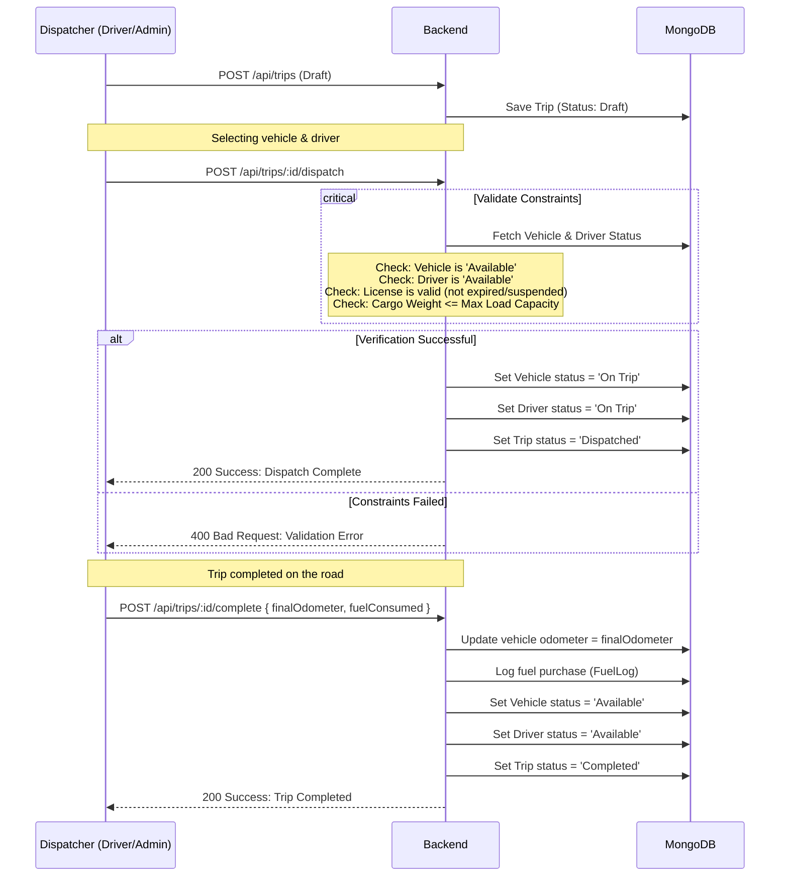
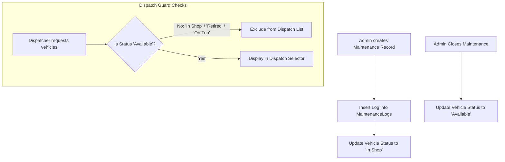

# 🚚 TransitOps: Smart Transport Operations Platform
### *Enterprise Fleet & Logistics Ecosystem • MERN + JWT/RBAC + Nodemailer + Chart.js/Recharts*
**Documentation Version:** 1.0 (Cumulative Technical Dossier)

---

## 📖 1. Project Introduction & Problem Statement

### 🎯 Overview
**TransitOps** is a centralized, end-to-end transport operations platform designed to digitize vehicle registry, driver profiles, dispatch scheduling, maintenance logs, and operational expenses. It replaces fragmented workflows and manual coordination (such as spreadsheet-based tracking and paper logs) with real-time operational visibility, automated business rule enforcement, and visual analytics dashboards. 

By unifying all aspects of logistics management, TransitOps ensures that dispatch decisions are safe, cost-efficient, and compliant with regulatory standards.

### ⚠️ The Problem Statement (In-Depth)
1. **Manual Logistics Bottlenecks:** Traditional transport agencies rely on error-prone spreadsheets, causing communication delays between fleet managers and drivers.
2. **Scheduling & Allocation Conflicts:** Without real-time status tracking, vehicles and drivers are frequently double-booked, resulting in underutilized fleet assets.
3. **Safety & Compliance Risks:** Assigning drivers with expired licenses or suspended status leads to severe regulatory penalties and safety hazards.
4. **Neglected Preventive Maintenance:** Missing scheduled service intervals results in vehicle breakdowns, high repair costs, and unexpected downtime.
5. **Inaccurate Cost & Profitability Tracking:** Scattered receipts and manual fuel logs obscure the true operational cost of vehicles, making it impossible to calculate accurate Return on Investment (ROI).

**TransitOps** solves these challenges by providing a MERN-based platform that:
- Centralizes vehicle registration and checks load/availability constraints in real-time.
- Protects operational flows with secure **Role-Based Access Control (RBAC)**.
- Validates driver eligibility automatically (license expiration, safety scores, current trip status).
- Automates status transitions (e.g., locking vehicles during maintenance, releasing them post-trip).
- Aggregates fuel logs and expenses to compute real-time operational costs, fuel efficiency, and vehicle ROI.

---

## 👥 2. Stakeholders & Functionality Matrix

| Stakeholder | Role | Core Functionalities |
| :--- | :--- | :--- |

| **Dispatcher / Driver** | The Operator | Manages the trip lifecycle (drafting, dispatching, and completing trips), assigns available vehicles/drivers, registers fuel purchases, and logs trip-end odometer metrics. |
| **Safety Officer** | The Compliance Inspector | Manages driver profiles, monitors license category match and expiration dates, updates safety scores, and configures automated email reminders for expiring licenses. |
| **Financial Analyst** | The Cost Controller | Logs tolls, driver allowances, and repair expenses; reviews fuel consumption costs, operational overhead, and generates CSV/PDF reports for fleet audits. |
| **System Admin** | The Moderator | Manages secure authentication, assigns user roles (RBAC), and monitors platform health. |
| **System Services** | Automation & Alerts | Node-cron scheduling triggers daily database status checks and sends license expiration emails to drivers and safety officers. |

---

## 🛠️ 3. Full-Stack Technical Architecture

### 🛡️ Core Infrastructure & Stack Decisions:
- **React 19 & Vite:** Fast HMR during development; optimized component rendering and light footprint using client-side routing.
- **MongoDB Atlas & Mongoose:** A flexible document database ideal for storing nested schemas such as logs, coordinates, cost breakdowns, and trip details.
- **JWT & Role-Based Access Control (RBAC):** Express middleware validates JSON Web Tokens (JWT) and enforces access permissions based on roles (`Admin`, `FleetManager`, `Driver`, `SafetyOfficer`, `FinancialAnalyst`).
- **Nodemailer / SMTP Service:** Handles automated system notifications (e.g., daily cron jobs checking for expiring driver licenses and sending email alerts).
- **TailwindCSS (v4) & Framer Motion:** Used to style highly responsive layout components (fully compatible with desktop, tablet, and mobile displays) and deliver smooth transition animations.
- **Recharts / Chart.js:** Renders dynamic analytics charts for fuel efficiency, utilization rates, and vehicle ROI comparison.

---

## 📂 4. Exhaustive File & Folder Directory

### 🚀 Backend Structure (`/server`)
- **`server.js`**: Application entry point. Integrates Express, database connections, cors, body parsers, cron scheduler, and sets up routes.
- **`config/`**
    - `mongodb.js`: Mongoose connection configuration with Atlas.
    - `nodemailer.js`: Configures SMTP transport credentials for mail delivery.
- **`controllers/`**
    - `authController.js`: Handles registration, secure login, password hashing, JWT generation, and profile retrieval.
    - `vehicleController.js`: Manages vehicle registry CRUD operations, status switches, and ROI aggregation.
    - `driverController.js`: Handles driver CRUD, license compliance checks, and safety score adjustments.
    - `tripController.js`: Handles trip dispatch validation, cargo weight logic, and trip status lifecycle transitions.
    - `maintenanceController.js`: Manages vehicle maintenance logs and automatically restricts vehicle selection.
    - `expenseController.js`: Registers fuel logs and general trip/maintenance expenses.
    - `reportController.js`: Generates aggregated metrics (Utilization, ROI, Fuel Efficiency) and handles CSV/PDF generation.
- **`middleware/`**
    - `authMiddleware.js`: Verifies JWT payload and extracts active user context.
    - `roleMiddleware.js`: Verifies user roles against requested route permissions (RBAC).
    - `errorMiddleware.js`: Standardizes API error responses.
- **`models/`**
    - `User.js`: Schema for users, passwords, and RBAC roles.
    - `Vehicle.js`: Schema for physical vehicles, status, load specifications, and total odometer.
    - `Driver.js`: Schema for driver credentials, license parameters, safety scores, and status.
    - `Trip.js`: Schema for origin/destination, cargo weight, planned distance, fuel consumption, and status transitions.
    - `MaintenanceLog.js`: Schema for repair logs, costs, status, and target vehicle.
    - `FuelLog.js`: Schema for fuel volume, cost, and odometer reading at fill-up.
    - `Expense.js`: Schema for miscellaneous expenses (tolls, maintenance, driver allowance).
- **`routes/`**
    - `authRoute.js`, `vehicleRoute.js`, `driverRoute.js`, `tripRoute.js`, `maintenanceRoute.js`, `expenseRoute.js`, `reportRoute.js`: Explicit routers mapping REST endpoints to controllers.
- **`utils/`**
    - `cronScheduler.js`: Cron jobs running scheduled tasks (e.g., license expiration emails).
    - `pdfGenerator.js`: Formats PDF summaries of reports.

### 🎨 Frontend Structure (`/client`)
- **`src/context/AppContext.jsx`**: React Context managing active session, selected filters, dashboard metrics, global configurations, and notifications.
- **`src/components/`**
    - `Navbar.jsx` & `Sidebar.jsx`: Global navigation responsive sidebar for desktop/mobile views.
    - `ProtectedRoute.jsx`: Client-side route guard enforcing authentication and RBAC limits.
    - `KpiCard.jsx`: Reusable KPI metric widgets (utilization, active trips, count of vehicles in shop).
    - `VehicleCard.jsx` & `DriverCard.jsx`: Detailed list grid items showing status pills and warning tags (e.g., expired license indicator).
    - `TripModal.jsx`: Form modal validation (calculates cargo limits dynamically based on the selected vehicle).
    - `ThemeToggle.jsx`: Global dark mode switch.
- **`src/pages/`**
    - `Login.jsx`: Secure login panel.
    - `Dashboard.jsx`: Analytics command center featuring dynamic charts, warnings for expiring licenses, and global filters (vehicle type, region).
    - `Vehicles.jsx`: Vehicle registry database with search, sort, and CRUD actions.
    - `Drivers.jsx`: Driver management portal showcasing compliance status, search, and details.
    - `Trips.jsx`: Dispatch pipeline representing Draft, Dispatched, Completed, and Cancelled trips.
    - `Maintenance.jsx`: Logging system for active shop work.
    - `Expenses.jsx`: Log files for fuel receipts, tolls, and maintenance invoices.
    - `Reports.jsx`: ROI charts, fuel efficiency curves, and CSV/PDF export options.

---

## 🗄️ 5. Database Schema (Granular Fields)

### `User` Collection
- `_id`: `ObjectId` (Required)
- `name`: `String` (Required)
- `email`: `String` (Required, Unique)
- `password`: `String` (Required, hashed with bcrypt)
- `role`: `String` (enum: `['Admin', 'FleetManager', 'Driver', 'SafetyOfficer', 'FinancialAnalyst']`, Required)
- `timestamps`: `Boolean`

### `Vehicle` Collection
- `registrationNumber`: `String` (Required, Unique, e.g., 'VAN-05')
- `modelName`: `String` (Required)
- `type`: `String` (enum: `['Semi-Truck', 'Box-Truck', 'Van', 'Flatbed', 'Sedan']`, Required)
- `maxLoadCapacity`: `Number` (Required, in kg)
- `odometer`: `Number` (Required, in km)
- `acquisitionCost`: `Number` (Required)
- `status`: `String` (enum: `['Available', 'On Trip', 'In Shop', 'Retired']`, default: `'Available'`)
- `region`: `String` (Required)
- `timestamps`: `Boolean`

### `Driver` Collection
- `name`: `String` (Required)
- `licenseNumber`: `String` (Required, Unique)
- `licenseCategory`: `String` (enum: `['Class A CDL', 'Class B CDL', 'Standard']`, Required)
- `licenseExpiryDate`: `Date` (Required)
- `contactNumber`: `String` (Required)
- `safetyScore`: `Number` (Required, min: `0`, max: `100`, default: `100`)
- `status`: `String` (enum: `['Available', 'On Trip', 'Off Duty', 'Suspended']`, default: `'Available'`)
- `timestamps`: `Boolean`

### `Trip` Collection
- `source`: `String` (Required)
- `destination`: `String` (Required)
- `vehicle`: `ObjectId` (Ref: `Vehicle`, Required)
- `driver`: `ObjectId` (Ref: `Driver`, Required)
- `cargoWeight`: `Number` (Required, in kg)
- `plannedDistance`: `Number` (Required, in km)
- `actualDistance`: `Number` (in km)
- `fuelConsumed`: `Number` (in liters)
- `finalOdometer`: `Number` (in km)
- `revenueGenerated`: `Number` (Required)
- `status`: `String` (enum: `['Draft', 'Dispatched', 'Completed', 'Cancelled']`, default: `'Draft'`)
- `dispatchedAt`: `Date`
- `completedAt`: `Date`
- `timestamps`: `Boolean`

### `MaintenanceLog` Collection
- `vehicle`: `ObjectId` (Ref: `Vehicle`, Required)
- `description`: `String` (Required, e.g., 'Oil change & brake pads replacement')
- `cost`: `Number` (Required)
- `startDate`: `Date` (Required)
- `endDate`: `Date` (Null if active)
- `status`: `String` (enum: `['Active', 'Closed']`, default: `'Active'`)
- `timestamps`: `Boolean`

### `FuelLog` Collection
- `vehicle`: `ObjectId` (Ref: `Vehicle`, Required)
- `liters`: `Number` (Required)
- `cost`: `Number` (Required)
- `date`: `Date` (Required)
- `odometerAtLog`: `Number` (Required)
- `timestamps`: `Boolean`

### `Expense` Collection
- `vehicle`: `ObjectId` (Ref: `Vehicle`, Required)
- `trip`: `ObjectId` (Ref: `Trip`, Optional)
- `category`: `String` (enum: `['Fuel', 'Maintenance', 'Toll', 'Driver Allowance', 'Insurance', 'Other']`, Required)
- `amount`: `Number` (Required)
- `date`: `Date` (Required)
- `description`: `String` (Required)
- `timestamps`: `Boolean`

---

## 📡 6. API Route Dictionary

### 🔑 Authentication Routes (`/api/auth`)
| Route | Method | Authentication | Description |
| :--- | :--- | :--- | :--- |
| `/api/auth/register` | `POST` | Admin | Registers a new user and hashes passwords. |
| `/api/auth/login` | `POST` | Public | Authenticates credentials and returns a JWT token. |
| `/api/auth/profile` | `GET` | Authenticated | Retrieves current user profile context. |

### 🚚 Vehicle Routes (`/api/vehicles`)
| Route | Method | Authentication | Description |
| :--- | :--- | :--- | :--- |
| `/api/vehicles/` | `POST` | FleetManager / Admin | Creates a new vehicle in the registry. |
| `/api/vehicles/` | `GET` | Authenticated | Lists all vehicles (supports filters by status, type, and region). |
| `/api/vehicles/:id` | `GET` | Authenticated | Retrieves specific vehicle details. |
| `/api/vehicles/:id` | `PUT` | FleetManager / Admin | Modifies vehicle specs, odometer values, or region. |
| `/api/vehicles/:id` | `DELETE` | Admin | Permanently deletes a vehicle record. |

### 👨🏻‍✈️ Driver Routes (`/api/drivers`)
| Route | Method | Authentication | Description |
| :--- | :--- | :--- | :--- |
| `/api/drivers/` | `POST` | SafetyOfficer / Admin | Creates a new driver profile with license details. |
| `/api/drivers/` | `GET` | Authenticated | Lists drivers (filters: status, safety score, license expiry status). |
| `/api/drivers/:id` | `GET` | Authenticated | Retrieves driver details. |
| `/api/drivers/:id` | `PUT` | SafetyOfficer / Admin | Updates details (renewed license expiry date, safety score). |
| `/api/drivers/:id` | `DELETE` | Admin | Removes driver from database. |

### 🗺️ Trip Routes (`/api/trips`)
| Route | Method | Authentication | Description |
| :--- | :--- | :--- | :--- |
| `/api/trips/` | `POST` | Driver / Admin | Creates a Trip in 'Draft' state (applies constraints). |
| `/api/trips/` | `GET` | Authenticated | Lists trips with status filters. |
| `/api/trips/:id/dispatch` | `POST` | Driver / Admin | Validates limits, dispatches trip; transitions vehicle/driver to `On Trip`. |
| `/api/trips/:id/complete` | `POST` | Driver / Admin | Receives final odometer/fuel usage, closes trip; returns assets to `Available`. |
| `/api/trips/:id/cancel` | `POST` | Driver / Admin | Cancels a dispatched trip; releases assets back to `Available`. |

### 🔧 Maintenance Routes (`/api/maintenance`)
| Route | Method | Authentication | Description |
| :--- | :--- | :--- | :--- |
| `/api/maintenance/` | `POST` | FleetManager / Admin | Logs new maintenance; locks vehicle in `In Shop` status. |
| `/api/maintenance/` | `GET` | Authenticated | Lists all active and closed maintenance logs. |
| `/api/maintenance/:id/close` | `POST` | FleetManager / Admin | Closes log, updates vehicle status to `Available` (creates corresponding expense entry). |

### 💰 Fuel & Expense Routes (`/api/expenses`)
| Route | Method | Authentication | Description |
| :--- | :--- | :--- | :--- |
| `/api/expenses/fuel` | `POST` | Driver / Admin | Creates a fuel log entry (creates corresponding expense automatically). |
| `/api/expenses/` | `POST` | FinancialAnalyst / Admin| Logs direct expenses (e.g., tolls, insurance payments). |
| `/api/expenses/vehicle/:vehicleId`| `GET` | Authenticated | Returns full cost breakdown for a specific vehicle. |

### 📈 Reports & Analytics Routes (`/api/reports`)
| Route | Method | Authentication | Description |
| :--- | :--- | :--- | :--- |
| `/api/reports/dashboard` | `GET` | Authenticated | Aggregates high-level metrics (Utilization, status ratios, KPIs). |
| `/api/reports/roi` | `GET` | FinancialAnalyst / Admin| Computes financial metrics (Acquisition Cost vs Revenue vs Expenses). |
| `/api/reports/export/csv` | `GET` | FinancialAnalyst / Admin| Generates and downloads a CSV report of fleet performance. |
| `/api/reports/export/pdf` | `GET` | FinancialAnalyst / Admin| Generates a formatted PDF summary of fleet financials. |

---

## 📊 7. Visual Persistence Flowcharts

### A. 🚚 The "TransitOps" Dispatch-to-Delivery Lifecycle


### B. 🔧 Maintenance Lockout Logic


### C. 📈 Financial & ROI Calculation Pipeline
```mermaid
graph LR
    Trips[Trips Completed: Revenue] --> Engine[ROI Analytics Engine]
    Fuel[Fuel Log: Cost] --> Engine
    Maint[Maintenance Log: Cost] --> Engine
    Other[Direct Expenses: Cost] --> Engine
    Acq[Vehicle Acquisition Cost] --> Engine
    
    Engine --> Calc[Formula: ROI = (Revenue - Expenses) / Acquisition Cost]
    Calc --> View[Dashboard ROI Table & Export Tools]
```

---

## ⚙️ 8. Project Setup & Deployment

### Prerequisites
- Node.js (v18+)
- MongoDB Atlas account (configured database instance)
- SMTP credentials (e.g., local SMTP server or standard Gmail App Password)

### Local Configuration Setup

#### 1. Backend Server Setup
- Navigate to the server root:
  ```bash
  cd server
  npm install
  ```
- Create a `.env` file in the `/server` directory:
  ```text
  PORT=4000
  MONGO_URI=mongodb+srv://<username>:<password>@cluster.mongodb.net/transitops
  JWT_SECRET=your_jwt_signing_secret_key
  
  # Email Configuration (for license expiry notifications)
  EMAIL_HOST=smtp.your-email-provider.com
  EMAIL_PORT=587
  EMAIL_USER=your_email_username
  EMAIL_PASS=your_email_password
  EMAIL_FROM=alerts@transitops.com
  ```
- Run the backend service:
  ```bash
  npm run dev
  ```
  *The API server launches on `http://localhost:4000`.*

#### 2. Frontend Client Setup
- Navigate to the client root:
  ```bash
  cd client
  npm install
  ```
- Create a `.env` file in the `/client` directory:
  ```text
  VITE_API_URL=http://localhost:4000/api
  ```
- Start the development server:
  ```bash
  npm run dev
  ```
  *The user interface runs on `http://localhost:5173`.*

---

## 🔮 9. Future Roadmap & Goals
- [ ] **📍 Telematics Integration:** Integrate GPS tracking for active trips on an interactive map.
- [ ] **🎥 Vehicle Document OCR:** Automatic OCR parser reading driver license images during registration.
- [ ] **🔔 Push Notifications:** Integrated Socket.io web push indicators alerting dispatcher of load failures or low safety scores.
- [ ] **📉 Predictive Maintenance:** Machine learning algorithm predicting vehicle breakdown probabilities based on model, age, and odometer logs.

---

## 🤝 10. Core Collaborators & Acknowledgements
- **Vrushti Patel**
- **Ruchi Patel**
- **Tithi Vinodkumar Mistry**
- **Nandana Suresh Nangakeyil**

---
*Manual v1.0 • Technical Dossier for TransitOps Smart Transport Operations Platform • 2026 🚛*
